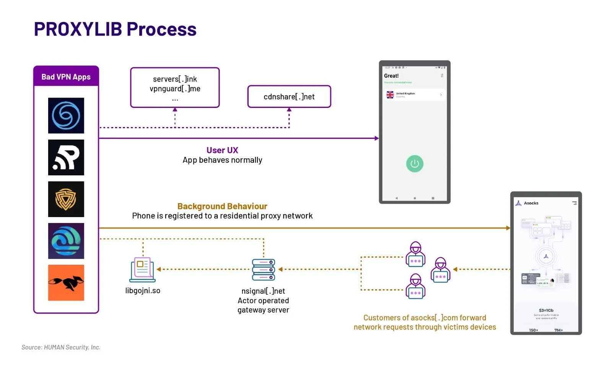

 
 
SUMMARY
 
<!--more-->
***
## Summary
- Over 15 free VPN apps available on Google Play were found to incorporate a malicious software development kit (SDK) that transformed Android devices into unwitting residential proxies, potentially facilitating cybercrime and shopping bot activities.
- Residential proxies reroute internet traffic through devices located in homes, making it appear legitimate and less likely to be blocked, despite being used nefariously for activities like ad fraud, spamming, and phishing.
- The malicious apps, disguised as free VPN software, utilized an SDK by LumiApps containing "Proxylib," a Golang library for proxying, identified by HUMAN's Satori threat intelligence team.
- The list of identified apps includes Lite VPN, Anims Keyboard, and several launcher apps by CaptainDroid, among others, all utilizing the ProxyLib library to convert Android devices into proxies.
- LumiApps, the SDK's developer, claims its tool uses users' IP addresses for benign purposes, such as loading webpages for data collection, but it's unclear if developers were aware of the proxying functionality.
- HUMAN links these apps to the Russian residential proxy service provider 'Asocks,' as connections were observed to the provider's website, frequently promoted to cybercriminals on hacking forums.

## Detection Opportunities and Indicators of Compromise (IoCs)

- Google removed offending apps from the Play Store and updated Google Play Protect to detect LumiApps libraries used in these apps.
- Users are advised to update to app versions not using the problematic SDK or uninstall the apps altogether if no safe version exists.
- Paid VPN apps may be a safer alternative to free ones, as free services are more likely to implement indirect monetization systems, including data collection, advertising, and enrollment in proxy services.

## Actions Taken

- Google removed apps using the LumiApps SDK from the Play Store and updated Play Protect to detect the SDK's usage.
- Some apps have reappeared on the Play Store, potentially after their developers removed the offending SDK or republished from different accounts.
Users are advised to update or uninstall apps, and Play Protect will warn users if apps have been removed from the Play Store.

## Affected apps

- Lite VPN
- Anims Keyboard
- Blaze Stride
- Byte Blade VPN
- Android 12 Launcher (by CaptainDroid)
- Android 13 Launcher (by CaptainDroid)
- Android 14 Launcher (by CaptainDroid)
- CaptainDroid Feeds
- Free Old Classic Movies (by CaptainDroid)
- Phone Comparison (by CaptainDroid)
- Fast Fly VPN
- Fast Fox VPN
- Fast Line VPN
- Funny Char Ging Animation
- Limo Edges
- Oko VPN
- Phone App Launcher
- Quick Flow VPN
- Sample VPN
- Secure Thunder
- Shine Secure
- Speed Surf
- Swift Shield VPN
- Turbo Track VPN
- Turbo Tunnel VPN
- Yellow Flash VPN
- VPN Ultra
- Run VPN

## Sources
- [Free VPN apps on Google Play turned Android phones into proxies](https://www.bleepingcomputer.com/news/security/free-vpn-apps-on-google-play-turned-android-phones-into-proxies/) by Bleeping Computer, 26 March 2024
- [Satori Threat Intelligence Alert: PROXYLIB and LumiApps Transform Mobile Devices into Proxy Nodes](https://www.humansecurity.com/learn/blog/satori-threat-intelligence-alert-proxylib-and-lumiapps-transform-mobile-devices-into-proxy-nodes) by HUMANSecurity, 26 March 2024