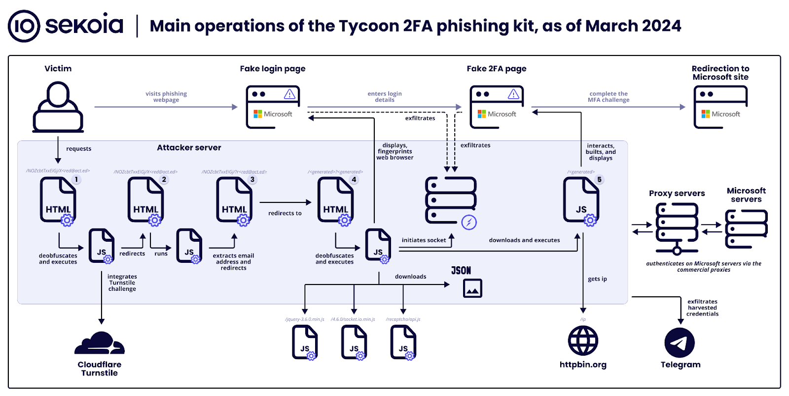

 
Cybercriminals are utilizing a new phishing-as-a-service (PhaaS) platform called 'Tycoon 2FA' to target Microsoft 365 and Gmail accounts and bypass two-factor authentication (2FA) protection.
Sekoia analysts discovered Tycoon 2FA in October 2023 during routine threat hunting, with activity observed since at least August 2023.

 
<!--more-->
***
 
The PhaaS kit shares similarities with other adversary-in-the-middle (AitM) platforms, suggesting potential code reuse or collaboration among developers.

In 2024, a new stealthier version of Tycoon 2FA was released, indicating ongoing efforts to enhance the kit.

Currently, Tycoon 2FA operates across 1,100 domains and has been implicated in thousands of phishing attacks.

## Tycoon 2FA Attacks

Tycoon 2FA attacks involve a multi-step process where session cookies are stolen using a reverse proxy server, allowing attackers to replay user sessions and bypass MFA mechanisms.
The attacks progress through seven distinct stages, including the distribution of malicious links, security challenges to filter out bots, and presentation of fake login pages to steal credentials.

## Evolution and Scale

The latest version of Tycoon 2FA introduces significant modifications to improve phishing and evasion capabilities, such as updates to JavaScript and HTML code and alterations in resource retrieval sequencing.
The scale of operations is substantial, with evidence of a broad user base of cybercriminals utilizing Tycoon 2FA for phishing, as indicated by transaction records linked to the Bitcoin wallet associated with the operators.

## Detection Opportunities and Indicators of Compromise (IoCs)

Sekoia provides a repository with over 50 entries of IoCs linked to Tycoon 2FA operations, aiding threat detection and mitigation efforts for threat analysts.
Notable detection opportunities include identifying pseudorandom names for URLs, improved detection of Tor network traffic and IP addresses associated with data centers, and rejection of traffic based on specific user-agent strings.

## Other PhaaS Platforms

Tycoon 2FA joins a landscape of PhaaS platforms capable of bypassing 2FA protections, including LabHost, Greatness, and Robin Banks, highlighting the diversity of options available to cybercriminals in conducting phishing operations targeting popular communication and productivity platforms. 

## Sources 

- [New MFA-bypassing phishing kit targets Microsoft 365, Gmail accounts](https://www.bleepingcomputer.com/news/security/new-mfa-bypassing-phishing-kit-targets-microsoft-365-gmail-accounts/) by Bleeping Computers, 27 March 2024
- [Tycoon 2FA: an in-depth analysis of the latest version of the AiTM phishing kit](https://blog.sekoia.io/tycoon-2fa-an-in-depth-analysis-of-the-latest-version-of-the-aitm-phishing-kit/) by Sekoia, 27 March 2024
- [Community/IOCs/tycoon2fa/tycoon2fa_iocs_20240325.csv](https://github.com/SEKOIA-IO/Community/blob/main/IOCs/tycoon2fa/tycoon2fa_iocs_20240325.csv) on GitHub, 27 March 2024