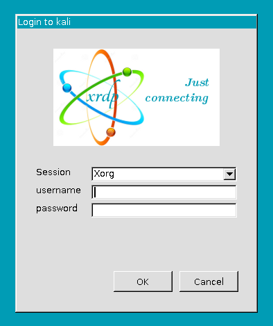

Kali Linux does not come with RDP enabled out of the box. But Kali can be configured to provide RDP access from any device with a proper RDP client. 

<!--more-->

## Some context for my specific case 
I set up Kali Linux for my lab environment on a hypervisor solution. As I am not working in front of that hypervisor, it would be nice to RDP into Kali from my laptop. 

## Configure RDP for Kali Linux 
I installed a new instance of Kali Linux 2021.2 and configured the VM to have working network connectivity with my laptop. We are using **xrdp** to sign in to the Linux VM. 

### Install xrdp on the Linux device 
Open a terminal on your Linux device and install xrdp via **apt-get**. 

```
sudo apt-get update 
sudo apt-get install xrdp
```

After the successful installation, we need to start xrdp as a service. 
```
sudo systemctl start xrdp
sudo systemctl start xrdp-sesman
```

### Test connection from your client 
xrdp is installed correctly and running. Let's see if we can connect and sign in. 

On your working device (in my case, a Windows device), open a terminal and connect via 
```
mstsc /v kali
```

or 

```
mstsc /v 10.0.0.100
```

where ***kali*** or ***10.0.0.100*** is either the Linux VMs hostname or IP. 
In case the connection was successful, you will see something similar to the image below. 




### Make RDP persistent 
After a reboot of the Linux device, you need to restart xrdp and xrdp-sesman (Session Manager) manually. Tell Linux to start xrdp automatically as a service to avoid this extra step after each reboot. 

```
sudo systemctl enable xrdp 
sudo systemctl enable xrdp-sesman
```

### Final thoughts 
Make sure you are not logged in anywhere else - e.g., Hyper-V Manager. Otherwise, this will prevent the RDP client from taking over the session. I haven't found a way around this yet.

So long...
