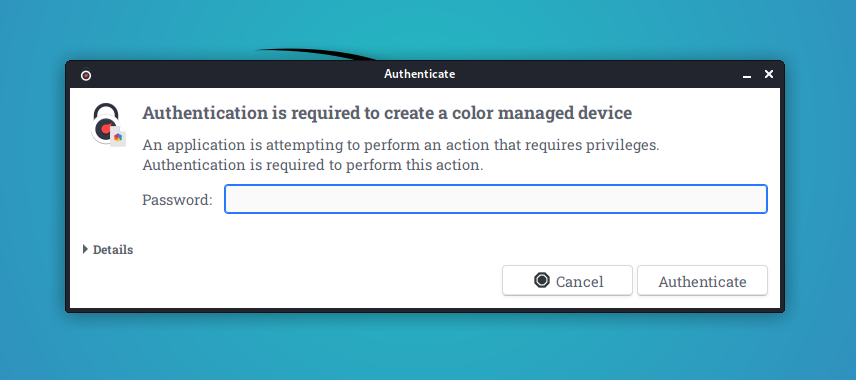

Many Debian based linux distro are using PolKit to enfore specific policies. Especially while working within a RDP session, this can become a major pain in the ass because of re-occurring pop-ups asking for credentials. This makes it almost impossible to do any work. 

<!--more-->




There is a good article[^fn1] which describes the issue in a more detailed fashion and how to resolve the issue. This post will be a brief summary for later reference. 

## How can we solve the problem?

The solution to this issue is, that we have to tell PolKit how to behave if a user is working remotely via RDP. And this can be done with a specific file in the folder 
```
/etc/polkit-1/localauthority/50-local.d/
```
Let's have a look, step by step. 

### Become root on the terminal as some resources require that special permissions.

```
sudo -i
```

### Check which version of pkaction (PolKit) is running.
In the next step, we have to check the version of pkaction. This will tell us in which direction we need to go. 


flowchart TD
  A[pkaction --version] 
  A --> |v0.106 and above?| C[*.conf]
  A --> |v0.105 and below?| D[*.pkla]


You can check the version in the terminal
```
pkaction --version 
```

The output looks something like this: 
```
pkaction version 0.105 
```

### Case A: (pkaction --version >= 0.106)

```
cd /etc/polkit-1/localauthority.d.conf
touch 02-allow-color.d.conf
nano 02-allow-color.d.conf
```

Add the following content to this file and save it.

```javascript
polkit.addRule(function(action, subject) {
 if ((action.id == "org.freedesktop.color-manager.create-device" ||
 action.id == "org.freedesktop.color-manager.create-profile" ||
 action.id == "org.freedesktop.color-manager.delete-device" ||
 action.id == "org.freedesktop.color-manager.delete-profile" ||
 action.id == "org.freedesktop.color-manager.modify-device" ||
 action.id == "org.freedesktop.color-manager.modify-profile") &&
 subject.isInGroup("{users}")) {
 return polkit.Result.YES;
 }
 });
```

### Case B: (pkaction --version < 0.106)

```
cd /etc/polkit-1/localauthority/50-local.d/
touch 45-allow-colord.pkla
nano 45-allow-colord.pkla
```

Add the following content to the file and save it.

```bash
[Allow Colord all Users] Identity=unix-user:* 
Action=org.freedesktop.color-manager.create-device;org.freedesktop.color-manager.create-profile;org.freedesktop.color-manager.delete-device;org.freedesktop.color-manager.delete-profile;org.freedesktop.color-manager.modify-device;org.freedesktop.color-manager.modify-profile; 
ResultAny=no 
ResultInactive=no 
ResultActive=yes
```

### Test the configuration

Now try to login via RDP to your machine. No popup should be visible and asking for any kind of credentials.

I highly recommend to read the original article[^fn1] as you will find very useful infos to understand the mechanism behind this behaviour and the proposed solutions.


[^fn1]: "xRDP - The Infamous 'Authentication Required to Create managed Color Device' Explained" | Griffon's IT Library (2021-Mar-22)](https://c-nergy.be/blog?p=12073)
